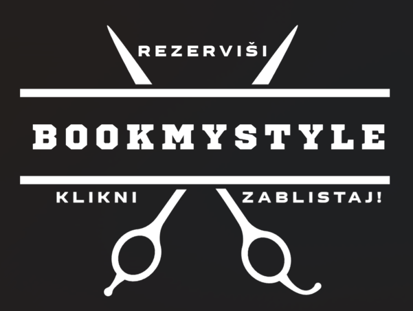

# **BookMyStyle**  
📌 *Rezerviši. Klikni. Zablistaj!*  

  

## **Opis projekta**  
**BookMyStyle** je web aplikacija koja omogućava korisnicima jednostavno i brzo zakazivanje frizerskih usluga, bilo u salonu ili na adresi korisnika. Aplikacija povezuje klijente sa frizerima i omogućava upravljanje terminima, recenzijama i cijenama usluga.  

## **Funkcionalnosti**  

### **Glavni meni**  
✅ Prikaz dostupnih termina i usluga  
✅ Pregled cjenovnika usluga  
✅ Recenzije korisnika  
✅ Kontakt informacije i lokacija salona  

### **Korisnik (Klijent)**  
✔ Zakazivanje termina u salonu ili na adresi  
✔ Pregled i ocjenjivanje usluga  
✔ Otkazivanje ili promjena termina  
✔ Primanje obavještenja o zakazanim terminima  

### **Zaposlenik (Frizer)**  
✔ Upravljanje dostupnim terminima  
✔ Pregled zakazanih termina  
✔ Potvrda dolaska na zakazani termin  
✔ Uvid u recenzije i ocjene  

### **Administrator (Vlasnik salona)**  
✔ Upravljanje korisnicima i zaposlenicima  
✔ Unos i uređivanje usluga i cijena  
✔ Statistika zakazanih termina  
✔ Prikaz finansijskih izvještaja  

## **Tehnologije**  
🔹 Frontend: HTML, CSS, JavaScript  
🔹 Backend: Node.js / Python (Django ili Flask)  
🔹 Baza podataka: MySQL / PostgreSQL  

## **Akteri sistema**  
👤 **Korisnik** – zakazuje termine i ocjenjuje usluge  
✂ **Zaposlenik** – pruža usluge i upravlja rasporedom  
🔧 **Administrator** – upravlja sistemom i korisnicima 
